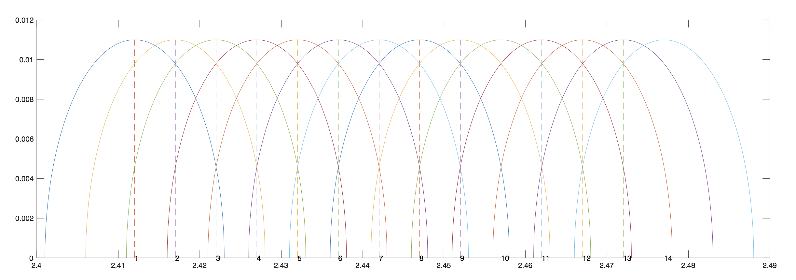

# 无线网络协议标准 

## 无线标准 (802.11标准)

定义了如下层

	 —— 数据链路层

	 ———— 逻辑链路控制子层LLC
	
	 ———— 媒体访问控制子层MAC
	
	 —— 物理层

标准的无线格式有 802.11F、802.11T

## 802.11

* 速率1Mbps或2Mbps

* 无线射频信号编码（调制）(radio frequence)  

	* Direct  Sequence Spread Spectrum (DSSS) ———— 直序扩频
	
	* Frequency Hopping Spread Spectrum (FHSS) ———— 跳频扩频

* 媒体访问方式 ———— CSMA/CA 载波侦听多路检测/冲突避免

	* 访问效率	   &nbsp;&nbsp; )

	* 根据算法侦听一定时间

	* 发送数据前发包声明

	* 产生冲突后，根据产生的随机数进行等待

	
## 802.11b
* Complementary Code Keying (CCK) ———————— 补充代码键

	* 5.5 and 11 Mbit/s
	
	* 2.4 GHz 带宽 (2.4 GHz - 2.485 GHz)
	
		* 14个重叠的信道channels
	
		* 每个信道22MHz带宽
	
		* 只有三个完全不重叠的信道
	
	
	
		美国 - 1 to 11 (2.412 GHz - 2.462 GHz)  （1、6、11）
		
		欧洲 - 1 to 13 (2.412 GHz - 2.472 GHz)   (2、7、12)
		
		日本 - 1 to 14 (2.412 GHz - 2.484 GHz)   (3、8、13)
		
## 802.11a
* 与802.11b几乎同时发布，但因为价格的问题一直没有得到广泛的使用

* 5 GHz 带宽

	* 2.4 GHz带宽干扰源多（微波、蓝牙、无绳电话）
	
	* 5 GHz频率有更多带宽空间，可容纳更多不重叠的通信
	
	* Orthogonal Frequency Division Multiplexing (OFDM) 正交频分复用技术
	* 最高速率54Mbps，每个信道20MHz带宽
	
	* 变频
	
		* 5.15 - 5.35 GHz 室内
		
		* 5.7 - 5.8 GHz 室外

		
## 802.11g
* 2.4 GHz 带宽

	* Orthogonal Frequency Division Multiplexing (OFDM) 正交频分复用技

	* 与802.11a速率相同

	* 可全局降速，向后兼容802.11b，并切换为CCK信号调制方法

	* 每个信道20/22MHz带宽

## 802.11n
* 2.4 或 5 GHz 带宽
	
	* 300Mbps 最高 600Mbps

	* 每个信道20/40MHz带宽

	* Multiple Input Multiple Output（MIMO）多进多出通信技术

	* 多天线，多无线电波，独立收发信号

	* 可以使用40MHz通信带宽使数据传输速率翻倍

* 全802.11n设备网络中，可以使用新报文格式，使速率达到最大
